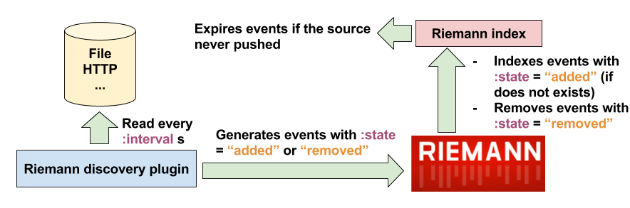

# riemann-discovery

Service discovery for Riemann ([riemann.io](http://riemann.io))

## Why ?

Detects a datasource that stopped sending events with Riemann is easy. You just need to index some events coming from the datasource and use a stream to detect expired events.

But what if a datasource hasn't emitted ? This plugin aims to solve this.

## How ?

This plugin will periodically read a datasource (files, HTTP endpoint, maybe consul etc... in the future) which shows the current state of the system (hosts, services...).
Then, it will continually generate events using the datasource content, and index these events. It will also remove outdated hosts and services, and index new ones (thus allowing the use of this plugin in a dynamic environment).

## Howto

### Loading the plugin

First, you should download the .jar file, and tell Riemann how to find it in your system using the `/etc/default/riemann` or `/etc/sysconfig/riemann` file and the EXTRA_CLASSPATH option.

Then, on your `riemann.config` file, add:

```clojure
(load-plugins)

(require '[riemann-discovery.core :as discovery])
```

You are now ready to use the plugin !

### Files based discovery

In a directory (for example `/etc/riemann/discovery`), creates a new file, for example named `services.edn`. It will contains the informations about your system, for example:

```clojure
{:ttl 120
 :services [{:hosts ["kafka1" "kafka2"]
             :name "kafka"
             :tags ["kafka"]
             :ttl 60}
            {:hosts ["api1"]
             :tags ["api"]
             :name "api"}]}

{:tags ["production"]
 :services [{:hosts ["zookeeper1"]
             :tags ["zookeeper"]
             :name "zookeeper"
             :ttl 60}]}
```

Here, informations are stored in [edn format](https://github.com/edn-format/edn). We have 2 maps in this configuration. Let's take the first one.

#### First map

We first have a `:ttl` key, with a value of 120. This means that all services defined in this map will have a default `:ttl` of 120. I will explain this later.

We also have a `:service` key. The value associated is a vector of map, each map describing a service.

The first map indicates that the service named `"kafka"` (the `:name` key) is running on hosts `"kafka1"` and `"kafka2"`. This service is also tagged `"kafka"`, and have a `:ttl` of 60.

The second map indicates that the service named `"api"` is running on host `"api1"`. This service is tagged `"api"`. Here, we don't have a `:ttl`, so this service will use the default `ttl` (120).

#### Second map

In the second map, we don't have a default `:ttl` but we have default `:tags` (here `"production"`). Default tags and service specific tags are merged together by the plugin.

here, we only have one service named `"zookeeper`", running on host `"zookeeper1"`, tagged `"zookeeper"` and with a `:ttl` of 60.

#### Plugin configuration

You should now configure the plugin in riemann.config:

```clojure

(discovery/discovery {:type :file
                      :interval 120}
                     {:path ["/etc/riemann/discovery/"]})

(let [index (index)]
  (streams
   (discovery/discovery-stream index)))

```

The `discovery/discovery` function takes 2 parameters:

- First parameter: a map containing global discovery options (common to all discovery mechanisms).
  - `:type`: The service discovery mechanism, here `:file`.
  - `:interval`: Every `:interval` seconds (120 in our case, default 60), Riemann will call the service discovery mechanism, and inject into itself events representing added/removed hosts.
  - `:tags`: Optional parameter, the value should be a list of tags. The plugin will only emit events tagged with all of these tags. It will emit all events if `:tags` is nil or empty. Example:

```clojure
:tags ["production"]
```

- Second parameter: a map containing the configuration of the discovery mechanism specified in the first parameter. For `:file`:
  - `:path`: A list of path to directories.

Emitted events are tagged `riemann-discovery`, and their states are either `added` or `removed`. **The "-discovery" string will be added to the service name** (see example below).

- `(discovery/discovery-stream index)` is a stream taking an index as parameter. It will capture events emitted by the `discovery` function, and add/remove them from the index.



In our example the `discovery` function will emit these events:

```clojure
INFO [2017-12-22 20:52:30,050] riemann task 1 - riemann.config - {:host zookeeper1, :service zookeeper-discovery, :time 1513972350029/1000, :tags [riemann-discovery production zookeeper], :state added, :ttl 60}
INFO [2017-12-22 20:52:30,051] riemann task 1 - riemann.config - {:host api1, :service api-discovery, :time 1513972350029/1000, :tags [riemann-discovery api], :state added, :ttl 120}
INFO [2017-12-22 20:52:30,052] riemann task 1 - riemann.config - {:host kafka2, :service kafka-discovery, :time 1513972350029/1000, :tags [riemann-discovery kafka], :state added, :ttl 60}
INFO [2017-12-22 20:52:30,052] riemann task 1 - riemann.config - {:host kafka1, :service kafka-discovery, :time 1513972350029/1000, :tags [riemann-discovery kafka], :state added, :ttl 60}
```

**Note**: events with `:state` = "added" already indexed will not be reindexed, otherwise it will never expire.

If you remove hosts or services from the edn file, events with `:state "removed"` would be sent, and removed from the index (so no false alert).

If any of these events expire, this means that your datasource stopped or never emitted.

*It's your responsability* to index events coming from your datasource to avoid expiration.

In my example i have `kafka` in the host `kafka1`. If i receive metrics from Kafka, i will index these events with `:service "kafka-discovery"`  to avoid expiration.

This means that you should carefully index events from your datasource and choose the right `:ttl` in your service discovery configuration, and use the right `:interval` option :

- `:interval` should probably always be < to your max `:ttl`, to be sure to remove removed hosts and services from the index before expiration.
- You can also push your own events tagged `riemann-discovery` with `:state` = "added" or "removed", the `discovery-stream` will take care to add/remove the events from the index.

### HTTP based discovery

Periodically send a GET request to an HTTP endpoint which must return the host/services list.

Please read the `File based discovery` section to understand how the plugin works and what are the default options.

#### Plugin configuration

In your `riemann.config`:

```clojure
(discovery/discovery {:type :http
                      :interval 120}
                     {:url "http://foo.foobar/discovery"
                      :http-options {}})
```

`:url` is the HTTP endpoint. It must returns a json body respecting this format:

```javascript
[{"ttl": 120,
  "services": [{"hosts": ["kafka1",
                          "kafka2"],
                "name": "kafka",
                "ttl": 60},
               {"hosts": ["api1"],
                "name": "api"}]},
 {"services": [{"hosts": ["zookeeper1"],
                "name":
                "zookeeper",
                "ttl": 60}]}]
```

Keys and values are the same as the file discovery mechanism.

`:http-options` could contains HTTP options from [clojure-http](https://github.com/dakrone/clj-http).
Default HTTP options are : `{:socket-timeout 1000 :conn-timeout 1000 :accept :json}`
